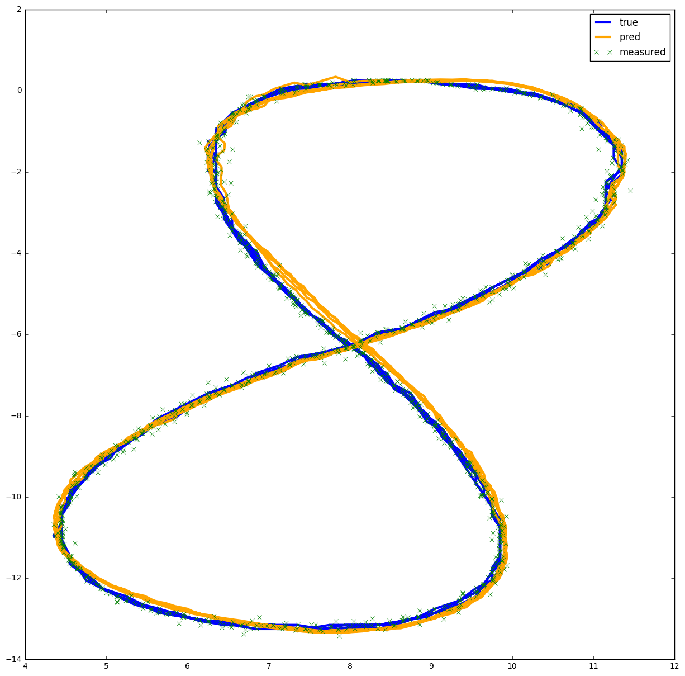

## Unscented Kalman Filter
Self-driving-car project

### Result

 |     | RMSE  |
 | --- |:-----:|
 | px  | 0.0769815 |
 | py  | 0.0847679 |
 | vx  | 0.600495  |
 | vy  |  0.581772 |

 ### Eestimated x-y

 ### Dependencies
  * cmake >= v3.5
  * make >= v4.1
  * gcc/g++ >= v5.4

### Basic build Instructions

1. Clone repo
2. make build directory 'mkdir build && cd build'
3. Compile 'cmake .. && make'
4. Run it './SDC_UKF path/to/input.txt path/to/output.txt'
